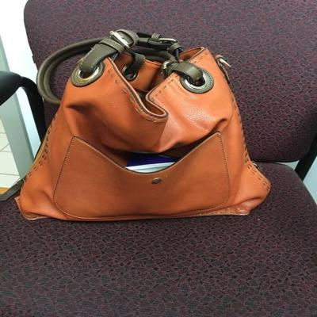

<h1 align="center">FacePareidolia</h1>

  
   

This project mainly focuses on differents between pareidolia and real faces and objects under the human visual perception system and VGG16 as the most human like neural network.

The procedure includes many training programmings, statistichal tests, and very deeep thinks behind everything.
plots, notebooks, training codes, model results and weights will be uploaded. 

## Feedback

If you had any feedback or question, please reach out to me at mh.nikimaleki@gmail.com
## 🔗 Links

